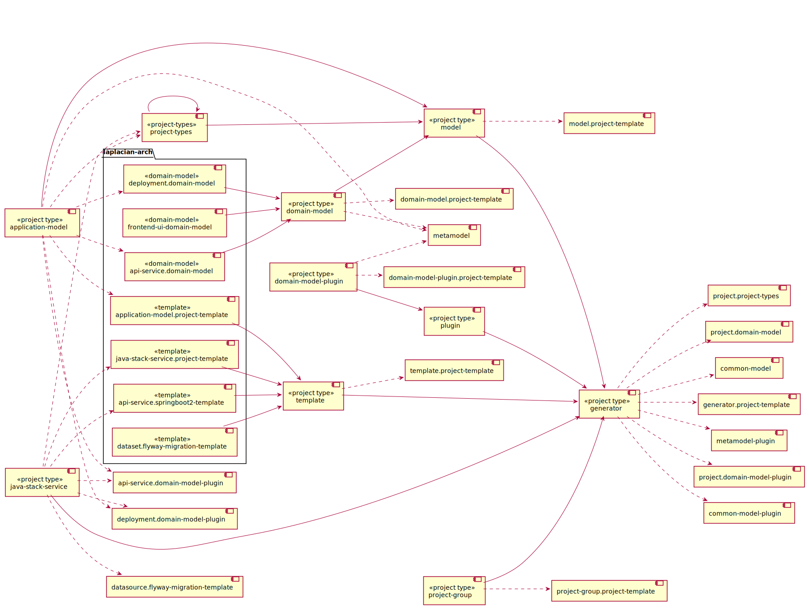

<!-- @head-content@ -->
# laplacian-arch/projects

projects.


*Read this in other languages*: [[日本語](README_ja.md)] [[简体中文](README_zh.md)]
<!-- @head-content@ -->

<!-- @toc@ -->
## Table of contents
- [Overview](#overview)

  * [Project dependencies](#project-dependencies)

- [Index](#index)

  * [Project list](#project-list)

  * [Script List](#script-list)

  * [Source code list](#source-code-list)


<!-- @toc@ -->

<!-- @main-content@ -->
## Overview


### Project dependencies


The following graph shows the dependencies between each project.


## Index


### Project list


- [**laplacian-arch/api-service.domain-model**](<https://github.com/laplacian-arch/api-service.domain-model.git>)

> A domain model that represents the logical structure of API services.
> This model is based on the REST resource model,
> GraphQL interface definition model, and the data source access model.
> 
- [**laplacian-arch/api-service.springboot2-template**](<https://github.com/laplacian-arch/api-service.springboot2-template.git>)

> This template generates a [SpringBoot2](https://spring.io/projects/spring-boot) based runtime based on an [API service model](https://github.com/nabla-squared/api-service.domain-model/).
> 
- [**laplacian-arch/application-model.project-template**](<https://github.com/laplacian-arch/application-model.project-template.git>)

> A project template for application model development projects.
> 
- [**laplacian-arch/dataset.flyway-migration-template**](<https://github.com/laplacian-arch/dataset.flyway-migration-template.git>)

> This template generates a database migration script with [flyway] (https:// flywaydb.org/) for the given dataset model.
> 
- [**laplacian-arch/deployment.domain-model**](<https://github.com/laplacian-arch/deployment.domain-model.git>)

> This model represents the deployment configuration of a system.
> 
- [**laplacian-arch/frontend-ui-domain-model**](<https://github.com/laplacian-arch/frontend-ui-domain-model.git>)

> The frontend-ui-domain-model project.
> 
- [**laplacian-arch/java-stack-service.project-template**](<https://github.com/laplacian-arch/java-stack-service.project-template.git>)

> The java-stack-service.project-template project.
> 
- [**laplacian-arch/project-types**](<https://github.com/laplacian-arch/project-types.git>)

> The model data that defines the content of each project type.
> 
### Script List


- [./script/create-new-application-model-project.sh](<./scripts/create-new-application-model-project.sh>)

  Adds a new application-model project to this project group.

  > Usage: create-new-application-model-project.sh [OPTION]...
  >
  > -h, --help
  >
  >   Displays how to use this command.
  >   
  > -v, --verbose
  >
  >   Displays more detailed command execution information.
  >   
  > , --project-name [VALUE]
  >
  >   New project's name
  >    (Default: application-model)
  > , --project-version [VALUE]
  >
  >   The initial version number
  >    (Default: 0.0.1)
  > , --namespace [VALUE]
  >
  >   Namespace
  >    (Default: laplacian.arch)
- [./script/create-new-domain-model-plugin-project.sh](<./scripts/create-new-domain-model-plugin-project.sh>)

  Adds a new domain-model-plugin project to this project group.

  > Usage: create-new-domain-model-plugin-project.sh [OPTION]...
  >
  > -h, --help
  >
  >   Displays how to use this command.
  >   
  > -v, --verbose
  >
  >   Displays more detailed command execution information.
  >   
  > , --project-name [VALUE]
  >
  >   New project's name
  >    (Default: domain-model-plugin)
  > , --project-version [VALUE]
  >
  >   The initial version number
  >    (Default: 0.0.1)
  > , --namespace [VALUE]
  >
  >   Namespace
  >    (Default: laplacian.arch)
- [./script/create-new-domain-model-project.sh](<./scripts/create-new-domain-model-project.sh>)

  Adds a new domain-model project to this project group.

  > Usage: create-new-domain-model-project.sh [OPTION]...
  >
  > -h, --help
  >
  >   Displays how to use this command.
  >   
  > -v, --verbose
  >
  >   Displays more detailed command execution information.
  >   
  > , --project-name [VALUE]
  >
  >   New project's name
  >    (Default: domain-model)
  > , --project-version [VALUE]
  >
  >   The initial version number
  >    (Default: 0.0.1)
  > , --namespace [VALUE]
  >
  >   Namespace
  >    (Default: laplacian.arch)
- [./script/create-new-generator-project.sh](<./scripts/create-new-generator-project.sh>)

  Adds a new generator project to this project group.

  > Usage: create-new-generator-project.sh [OPTION]...
  >
  > -h, --help
  >
  >   Displays how to use this command.
  >   
  > -v, --verbose
  >
  >   Displays more detailed command execution information.
  >   
  > , --project-name [VALUE]
  >
  >   New project's name
  >    (Default: generator)
  > , --project-version [VALUE]
  >
  >   The initial version number
  >    (Default: 0.0.1)
  > , --namespace [VALUE]
  >
  >   Namespace
  >    (Default: laplacian.arch)
- [./script/create-new-java-stack-service-project.sh](<./scripts/create-new-java-stack-service-project.sh>)

  Adds a new java-stack-service project to this project group.

  > Usage: create-new-java-stack-service-project.sh [OPTION]...
  >
  > -h, --help
  >
  >   Displays how to use this command.
  >   
  > -v, --verbose
  >
  >   Displays more detailed command execution information.
  >   
  > , --project-name [VALUE]
  >
  >   New project's name
  >    (Default: java-stack-service)
  > , --project-version [VALUE]
  >
  >   The initial version number
  >    (Default: 0.0.1)
  > , --namespace [VALUE]
  >
  >   Namespace
  >    (Default: laplacian.arch)
- [./script/create-new-model-project.sh](<./scripts/create-new-model-project.sh>)

  Adds a new model project to this project group.

  > Usage: create-new-model-project.sh [OPTION]...
  >
  > -h, --help
  >
  >   Displays how to use this command.
  >   
  > -v, --verbose
  >
  >   Displays more detailed command execution information.
  >   
  > , --project-name [VALUE]
  >
  >   New project's name
  >    (Default: model)
  > , --project-version [VALUE]
  >
  >   The initial version number
  >    (Default: 0.0.1)
  > , --namespace [VALUE]
  >
  >   Namespace
  >    (Default: laplacian.arch)
- [./script/create-new-plugin-project.sh](<./scripts/create-new-plugin-project.sh>)

  Adds a new plugin project to this project group.

  > Usage: create-new-plugin-project.sh [OPTION]...
  >
  > -h, --help
  >
  >   Displays how to use this command.
  >   
  > -v, --verbose
  >
  >   Displays more detailed command execution information.
  >   
  > , --project-name [VALUE]
  >
  >   New project's name
  >    (Default: plugin)
  > , --project-version [VALUE]
  >
  >   The initial version number
  >    (Default: 0.0.1)
  > , --namespace [VALUE]
  >
  >   Namespace
  >    (Default: laplacian.arch)
- [./script/create-new-project-group-project.sh](<./scripts/create-new-project-group-project.sh>)

  Adds a new project-group project to this project group.

  > Usage: create-new-project-group-project.sh [OPTION]...
  >
  > -h, --help
  >
  >   Displays how to use this command.
  >   
  > -v, --verbose
  >
  >   Displays more detailed command execution information.
  >   
  > , --project-name [VALUE]
  >
  >   New project's name
  >    (Default: project-group)
  > , --project-version [VALUE]
  >
  >   The initial version number
  >    (Default: 0.0.1)
  > , --namespace [VALUE]
  >
  >   Namespace
  >    (Default: laplacian.arch)
- [./script/create-new-project-types-project.sh](<./scripts/create-new-project-types-project.sh>)

  Adds a new project-types project to this project group.

  > Usage: create-new-project-types-project.sh [OPTION]...
  >
  > -h, --help
  >
  >   Displays how to use this command.
  >   
  > -v, --verbose
  >
  >   Displays more detailed command execution information.
  >   
  > , --project-name [VALUE]
  >
  >   New project's name
  >    (Default: project-types)
  > , --project-version [VALUE]
  >
  >   The initial version number
  >    (Default: 0.0.1)
  > , --namespace [VALUE]
  >
  >   Namespace
  >    (Default: laplacian.arch)
- [./script/create-new-template-project.sh](<./scripts/create-new-template-project.sh>)

  Adds a new template project to this project group.

  > Usage: create-new-template-project.sh [OPTION]...
  >
  > -h, --help
  >
  >   Displays how to use this command.
  >   
  > -v, --verbose
  >
  >   Displays more detailed command execution information.
  >   
  > , --project-name [VALUE]
  >
  >   New project's name
  >    (Default: template)
  > , --project-version [VALUE]
  >
  >   The initial version number
  >    (Default: 0.0.1)
  > , --namespace [VALUE]
  >
  >   Namespace
  >    (Default: laplacian.arch)
- [./script/do-each-subproject.sh](<./scripts/do-each-subproject.sh>)

  Executes the command specified by the argument for each subproject.

  Example:
  ```console
  $ ./scripts/ -c git status
  ```

  > Usage: do-each-subproject.sh [OPTION]...
  >
  > -h, --help
  >
  >   Displays how to use this command.
  >   
  > -v, --verbose
  >
  >   Displays more detailed command execution information.
  >   
  > -c, --continue-on-error
  >
  >   Even if the given command fails in a subproject in the middle, executes it for the remaining subprojects.
  >   
- [./script/generate-all.sh](<./scripts/generate-all.sh>)

  Generates resources in the project, including subprojects.

  > Usage: generate-all.sh [OPTION]...
  >
  > -h, --help
  >
  >   Displays how to use this command.
  >   
  > -v, --verbose
  >
  >   Displays more detailed command execution information.
  >   
  > -c, --continue-on-error
  >
  >   Even if the given command fails in a subproject in the middle, executes it for the remaining subprojects.
  >   
- [./script/generate-api-service-domain-model.sh](<./scripts/generate-api-service-domain-model.sh>)

  Generates the [laplacian-arch/api-service.domain-model](<https://github.com/laplacian-arch/api-service.domain-model.git>) project as a subproject in the following directory.
  ```
  subprojects/api-service-domain-model
  ```
  If the subproject already exists, the content of the subproject is updated.

  > Usage: generate-api-service-domain-model.sh [OPTION]...
  >
  > -h, --help
  >
  >   Displays how to use this command.
  >   
  > -v, --verbose
  >
  >   Displays more detailed command execution information.
  >   
  > -c, --clean
  >
  >   Delete all local resources of the subproject and regenerate them.
  >   
- [./script/generate-api-service-springboot2-template.sh](<./scripts/generate-api-service-springboot2-template.sh>)

  Generates the [laplacian-arch/api-service.springboot2-template](<https://github.com/laplacian-arch/api-service.springboot2-template.git>) project as a subproject in the following directory.
  ```
  subprojects/api-service-springboot2-template
  ```
  If the subproject already exists, the content of the subproject is updated.

  > Usage: generate-api-service-springboot2-template.sh [OPTION]...
  >
  > -h, --help
  >
  >   Displays how to use this command.
  >   
  > -v, --verbose
  >
  >   Displays more detailed command execution information.
  >   
  > -c, --clean
  >
  >   Delete all local resources of the subproject and regenerate them.
  >   
- [./script/generate-application-model-project-template.sh](<./scripts/generate-application-model-project-template.sh>)

  Generates the [laplacian-arch/application-model.project-template](<https://github.com/laplacian-arch/application-model.project-template.git>) project as a subproject in the following directory.
  ```
  subprojects/application-model-project-template
  ```
  If the subproject already exists, the content of the subproject is updated.

  > Usage: generate-application-model-project-template.sh [OPTION]...
  >
  > -h, --help
  >
  >   Displays how to use this command.
  >   
  > -v, --verbose
  >
  >   Displays more detailed command execution information.
  >   
  > -c, --clean
  >
  >   Delete all local resources of the subproject and regenerate them.
  >   
- [./script/generate-dataset-flyway-migration-template.sh](<./scripts/generate-dataset-flyway-migration-template.sh>)

  Generates the [laplacian-arch/dataset.flyway-migration-template](<https://github.com/laplacian-arch/dataset.flyway-migration-template.git>) project as a subproject in the following directory.
  ```
  subprojects/dataset-flyway-migration-template
  ```
  If the subproject already exists, the content of the subproject is updated.

  > Usage: generate-dataset-flyway-migration-template.sh [OPTION]...
  >
  > -h, --help
  >
  >   Displays how to use this command.
  >   
  > -v, --verbose
  >
  >   Displays more detailed command execution information.
  >   
  > -c, --clean
  >
  >   Delete all local resources of the subproject and regenerate them.
  >   
- [./script/generate-deployment-domain-model.sh](<./scripts/generate-deployment-domain-model.sh>)

  Generates the [laplacian-arch/deployment.domain-model](<https://github.com/laplacian-arch/deployment.domain-model.git>) project as a subproject in the following directory.
  ```
  subprojects/deployment-domain-model
  ```
  If the subproject already exists, the content of the subproject is updated.

  > Usage: generate-deployment-domain-model.sh [OPTION]...
  >
  > -h, --help
  >
  >   Displays how to use this command.
  >   
  > -v, --verbose
  >
  >   Displays more detailed command execution information.
  >   
  > -c, --clean
  >
  >   Delete all local resources of the subproject and regenerate them.
  >   
- [./script/generate-frontend-ui-domain-model.sh](<./scripts/generate-frontend-ui-domain-model.sh>)

  Generates the [laplacian-arch/frontend-ui-domain-model](<https://github.com/laplacian-arch/frontend-ui-domain-model.git>) project as a subproject in the following directory.
  ```
  subprojects/frontend-ui-domain-model
  ```
  If the subproject already exists, the content of the subproject is updated.

  > Usage: generate-frontend-ui-domain-model.sh [OPTION]...
  >
  > -h, --help
  >
  >   Displays how to use this command.
  >   
  > -v, --verbose
  >
  >   Displays more detailed command execution information.
  >   
  > -c, --clean
  >
  >   Delete all local resources of the subproject and regenerate them.
  >   
- [./script/generate-java-stack-service-project-template.sh](<./scripts/generate-java-stack-service-project-template.sh>)

  Generates the [laplacian-arch/java-stack-service.project-template](<https://github.com/laplacian-arch/java-stack-service.project-template.git>) project as a subproject in the following directory.
  ```
  subprojects/java-stack-service-project-template
  ```
  If the subproject already exists, the content of the subproject is updated.

  > Usage: generate-java-stack-service-project-template.sh [OPTION]...
  >
  > -h, --help
  >
  >   Displays how to use this command.
  >   
  > -v, --verbose
  >
  >   Displays more detailed command execution information.
  >   
  > -c, --clean
  >
  >   Delete all local resources of the subproject and regenerate them.
  >   
- [./script/generate-project-types.sh](<./scripts/generate-project-types.sh>)

  Generates the [laplacian-arch/project-types](<https://github.com/laplacian-arch/project-types.git>) project as a subproject in the following directory.
  ```
  subprojects/project-types
  ```
  If the subproject already exists, the content of the subproject is updated.

  > Usage: generate-project-types.sh [OPTION]...
  >
  > -h, --help
  >
  >   Displays how to use this command.
  >   
  > -v, --verbose
  >
  >   Displays more detailed command execution information.
  >   
  > -c, --clean
  >
  >   Delete all local resources of the subproject and regenerate them.
  >   
- [./script/generate.sh](<./scripts/generate.sh>)

  Generates the resources in each directory of `src/` `model/` `template/` in this project.
  The results are reflected in each directory of `dest/` `doc/` `script/`.

  *Generator input files*

  - `src/`
    Stores static resources that are not processed the generator.
    The contents of this directory are copied directly into the `dest/` directory.

  - `model/`
    Stores the static model data files written in *YAML* or *JSON* format used for the generation.

  - `template/`
    This directory contains the template files used for the generation.
    Files with a extension `.hbs` will be handled as templates. All other files are copied as is.

    - `template/dest` `template/doc` `template/scripts`
      Each of these directories contains the template files of the resource to be output
      in the directory `dest/` `doc/` `scripts`.

    - `template/model` `template/template`
      These directories store template files updating the contents of `template/` and `model/` used for the generation.
      If the content of `template/` `model/` is updated as a result of the generation,
      the generation process is executed recursively.
      The changes to `template/` `model/` that occur during the above process are treated as an intermediate state
      and will be lost after the completion of the process.
      Use the *--dry-run* option to check these intermediate files.

  *Generator output files*

  - `dest/`
    Outputs the source files of applications and modules created as the result of
    the generation process.

  - `doc/`
    Outputs the project documentation.

  - `scripts/`
    Outputs various scripts used in development and operation.

  > Usage: generate.sh [OPTION]...
  >
  > -h, --help
  >
  >   Displays how to use this command.
  >   
  > -v, --verbose
  >
  >   Displays more detailed command execution information.
  >   
  > -d, --dry-run
  >
  >   After this command is processed, the generated files are output to the `.NEXT` directory
  >   without reflecting to the folders of `dest/` `doc/` `scripts/`.
  >   In addition, the difference between the contents of the `.NEXT` directory and the current files.
  >   This directory also contains any intermediate files created during the generation.
  >   
  > -r, --max-recursion [VALUE]
  >
  >   The upper limit of the number of times to execute recursively
  >   when the contents of the `model/` `template/` directory are updated
  >   during the generation process.
  >    (Default: 10)
  > , --local-module-repository [VALUE]
  >
  >   The repository path to store locally built modules.
  >   The modules in this repository have the highest priority.
  >   
  > , --updates-scripts-only
  >
  >   Updates script files only.
  >   This option is used to generate the generator script itself
  >   when the project is initially generated.
  >   
- [./script/git-each-subproject.sh](<./scripts/git-each-subproject.sh>)

  Executes the git sub-command specified by the argument for each subproject.

  Example:
  ```console
  $ ./scripts/ -c status
  ```

  > Usage: git-each-subproject.sh [OPTION]...
  >
  > -h, --help
  >
  >   Displays how to use this command.
  >   
  > -v, --verbose
  >
  >   Displays more detailed command execution information.
  >   
  > -c, --continue-on-error
  >
  >   Even if the given command fails in a subproject in the middle, executes it for the remaining subprojects.
  >   
- [./script/publish-local.sh](<./scripts/publish-local.sh>)

  After the resources in the project are generated,
  the resources in the `./dest` directory are built as a generator module
  and registered in the local repository.

  > Usage: publish-local.sh [OPTION]...
  >
  > -h, --help
  >
  >   Displays how to use this command.
  >   
  > -v, --verbose
  >
  >   Displays more detailed command execution information.
  >   
  > -r, --max-recursion [VALUE]
  >
  >   This option is the same as the option of the same name in [generate.sh](<./scripts/generate.sh>).
  >    (Default: 10)
  > , --skip-generation
  >
  >   This option is the same as the option of the same name in [generate.sh](<./scripts/generate.sh>).
  >   
  > , --local-module-repository [VALUE]
  >
  >   The path to the local repository where the built module will be stored.
  >   If the repository does not exist in the specified path, it will be created automatically.
  >   
- [./script/publish-local-api-service-domain-model.sh](<./scripts/publish-local-api-service-domain-model.sh>)

  Generates resources for the [laplacian-arch/api-service.domain-model](<https://github.com/laplacian-arch/api-service.domain-model.git>) subproject.

  > Usage: publish-local-api-service-domain-model.sh [OPTION]...
  >
  > -h, --help
  >
  >   Displays how to use this command.
  >   
  > -v, --verbose
  >
  >   Displays more detailed command execution information.
  >   
- [./script/publish-local-api-service-springboot2-template.sh](<./scripts/publish-local-api-service-springboot2-template.sh>)

  Generates resources for the [laplacian-arch/api-service.springboot2-template](<https://github.com/laplacian-arch/api-service.springboot2-template.git>) subproject.

  > Usage: publish-local-api-service-springboot2-template.sh [OPTION]...
  >
  > -h, --help
  >
  >   Displays how to use this command.
  >   
  > -v, --verbose
  >
  >   Displays more detailed command execution information.
  >   
- [./script/publish-local-application-model-project-template.sh](<./scripts/publish-local-application-model-project-template.sh>)

  Generates resources for the [laplacian-arch/application-model.project-template](<https://github.com/laplacian-arch/application-model.project-template.git>) subproject.

  > Usage: publish-local-application-model-project-template.sh [OPTION]...
  >
  > -h, --help
  >
  >   Displays how to use this command.
  >   
  > -v, --verbose
  >
  >   Displays more detailed command execution information.
  >   
- [./script/publish-local-dataset-flyway-migration-template.sh](<./scripts/publish-local-dataset-flyway-migration-template.sh>)

  Generates resources for the [laplacian-arch/dataset.flyway-migration-template](<https://github.com/laplacian-arch/dataset.flyway-migration-template.git>) subproject.

  > Usage: publish-local-dataset-flyway-migration-template.sh [OPTION]...
  >
  > -h, --help
  >
  >   Displays how to use this command.
  >   
  > -v, --verbose
  >
  >   Displays more detailed command execution information.
  >   
- [./script/publish-local-deployment-domain-model.sh](<./scripts/publish-local-deployment-domain-model.sh>)

  Generates resources for the [laplacian-arch/deployment.domain-model](<https://github.com/laplacian-arch/deployment.domain-model.git>) subproject.

  > Usage: publish-local-deployment-domain-model.sh [OPTION]...
  >
  > -h, --help
  >
  >   Displays how to use this command.
  >   
  > -v, --verbose
  >
  >   Displays more detailed command execution information.
  >   
- [./script/publish-local-frontend-ui-domain-model.sh](<./scripts/publish-local-frontend-ui-domain-model.sh>)

  Generates resources for the [laplacian-arch/frontend-ui-domain-model](<https://github.com/laplacian-arch/frontend-ui-domain-model.git>) subproject.

  > Usage: publish-local-frontend-ui-domain-model.sh [OPTION]...
  >
  > -h, --help
  >
  >   Displays how to use this command.
  >   
  > -v, --verbose
  >
  >   Displays more detailed command execution information.
  >   
- [./script/publish-local-java-stack-service-project-template.sh](<./scripts/publish-local-java-stack-service-project-template.sh>)

  Generates resources for the [laplacian-arch/java-stack-service.project-template](<https://github.com/laplacian-arch/java-stack-service.project-template.git>) subproject.

  > Usage: publish-local-java-stack-service-project-template.sh [OPTION]...
  >
  > -h, --help
  >
  >   Displays how to use this command.
  >   
  > -v, --verbose
  >
  >   Displays more detailed command execution information.
  >   
- [./script/publish-local-project-types.sh](<./scripts/publish-local-project-types.sh>)

  Generates resources for the [laplacian-arch/project-types](<https://github.com/laplacian-arch/project-types.git>) subproject.

  > Usage: publish-local-project-types.sh [OPTION]...
  >
  > -h, --help
  >
  >   Displays how to use this command.
  >   
  > -v, --verbose
  >
  >   Displays more detailed command execution information.
  >   
### Source code list


- [model/project/subprojects/laplacian-arch/api-service.domain-model.yaml](<./model/project/subprojects/laplacian-arch/api-service.domain-model.yaml>)
- [model/project/subprojects/laplacian-arch/api-service.springboot2-template.yaml](<./model/project/subprojects/laplacian-arch/api-service.springboot2-template.yaml>)
- [model/project/subprojects/laplacian-arch/application-model.project-template.yaml](<./model/project/subprojects/laplacian-arch/application-model.project-template.yaml>)
- [model/project/subprojects/laplacian-arch/datasource.flyway-migration-template.yaml](<./model/project/subprojects/laplacian-arch/datasource.flyway-migration-template.yaml>)
- [model/project/subprojects/laplacian-arch/deployment.domain-model.yaml](<./model/project/subprojects/laplacian-arch/deployment.domain-model.yaml>)
- [model/project/subprojects/laplacian-arch/frontend-ui-domain-model.yaml](<./model/project/subprojects/laplacian-arch/frontend-ui-domain-model.yaml>)
- [model/project/subprojects/laplacian-arch/java-stack-service.project-template.yaml](<./model/project/subprojects/laplacian-arch/java-stack-service.project-template.yaml>)
- [model/project/subprojects/laplacian-arch/project-types.yaml](<./model/project/subprojects/laplacian-arch/project-types.yaml>)
- [model/project.yaml](<./model/project.yaml>)


<!-- @main-content@ -->